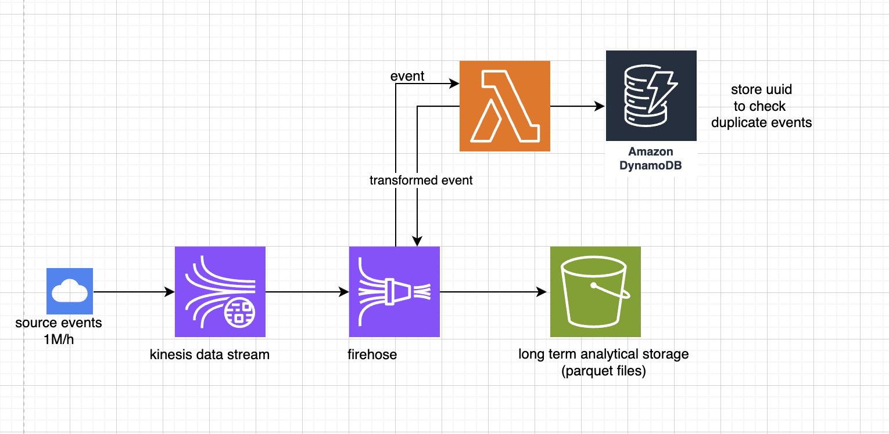

# Introduction

We want to design a streaming system for an analytical purpose that ingests events and performs transformation and stores the results in S3 for future use. 

The volume of generated events is quite large with 1M events per hour or around 300 events per second and we should not miss any event and need to ingest them in real time. 

we cannot directly send events to the end data storage because of multiple reasons: 
- the system might fail and go down and then we'll miss events
- we should not need to waite for a response which adds latency 
- The number of events can go up or down in different time slots and we have to scale the system accordingly

So instead of sending events directly to the end storage, we send them to a streaming platform: in this case Kinesis Data Stream. Kinesis Data Stream can scale easily with more number of shards and can handle a very high scale. Each shard can support writes up to 1,000 records per second, up to a maximum data write total of 1 MiB per second.

Kinesis supports "On-demand" and "Provisioned" capacity and with on-demnand it can automatically scale up and down. Therefore if we have varying amont of events over time it is better to use this capacity. With Provisioned capacity we haev to define the number of Kinesis shards when we create the Kinesis Data Stream instance. It allows for better cost control and scaling only is possible manually.
Events are stored in the Kinesis shards and there is no limitation in receiving events. Retention period (by default being 24h) is the time length that events are accessible in shards and need to be consumed. Therefore we use Firehose to send data to the end destination. Firehose can also apply transformations before storing the event in the destination. Lambda gets triggered when a new event is recieved by the Firehose to transform the event. We can use the transformation to convert the data stream into formats such as Parquet as well.

DynamoDB is a serverless, NoSQL, fully managed database service with single-digit millisecond response times at any scale, that can be used as a store event uuids to check for duplicates.

S3 is the destination where the ingested data will be stored and it can work as a data lake.



# Design Questions

1. How would you handle the duplicate events? What quality metrics would you define for the input data?

To Handle duplicate events we can store the event_uuids in a temperory storage or a dynamo db instance and before processing the event check first if the event_uuid already exists or not and only process the events that the uuid does not exist in the storage.

Quality metrics: 
- all expected fields exist in the events
- field validation and verify if the values have the correct format. For example created_at should be a timestamp and event_name should include ":"
- the values are valid and there is no unexpected value. For example created_at should be less than the current timestamp


2. How would you partition the data to ensure good performance and scalability? Would your proposed solution
still be the same if the amount of events is 1000 times smaller or bigger?

Partitioning could be based on different criteria such as event_type or create_datetime. I would use the same partitioning strategy for higher volume but extend the Kinesis shards, number of partitions and processing power

3. What format would you use to store the data?

As we would like to store the events in a data lake for further analytical purposes, I would select a columnar data format like .parquet to query a subset of data or filter on a value faster. Parquet also uses compression algorithm to store similar data types ending in a smaller file size. 


# How to

The infrastructure directory includes Terraform IaC to initialize all services in S3 as described in the upper image. 


```
cd infrastructure
terraform init
terraform apply
```

generate_events cerates 1M events per hour and sends them to Kinesis Data Sream.

```
cd ../src
python generate_events.py
```
The docker file needs to be deployed to the ecr which is then used to transform the events automatically.

A batch job runs every night at 12 AM to load data from the short storage to the analytical storage for the passed day.